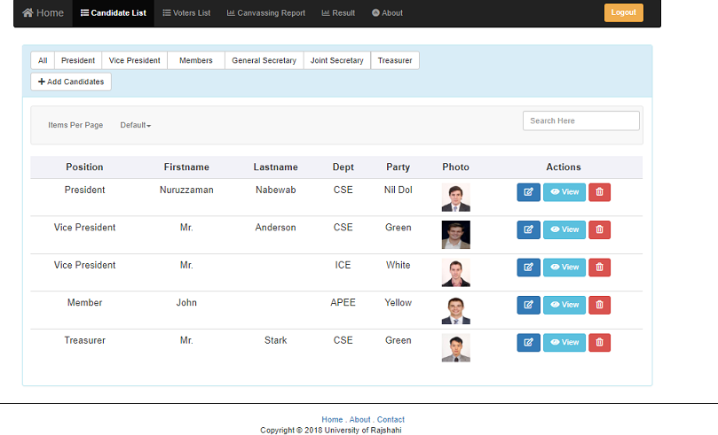
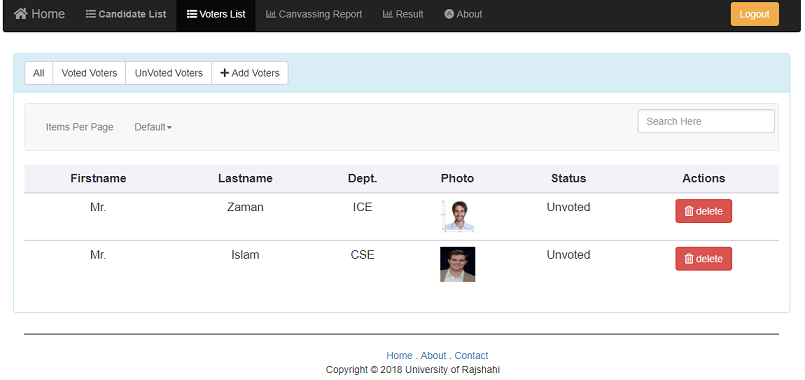
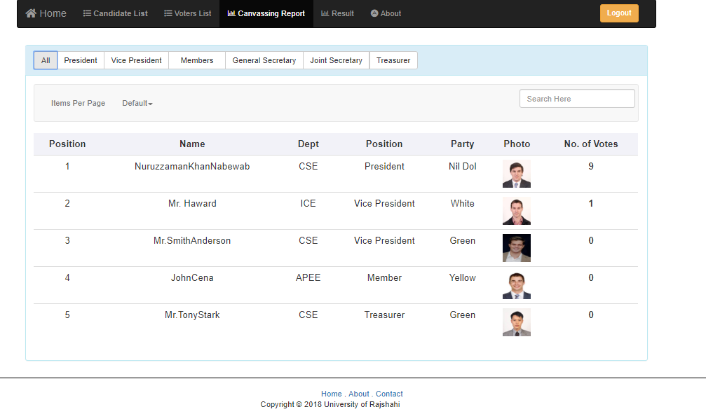

# E-Voting
It is an automatic voting system for RU teachers association election. Here association's teachers can take part in election from home and with their mobile/computer. It will save time and also save hard work for vote counting, ballot paper printing etc. This platform is built for 'Rajshahi University Teachers Association' and with some updates it can be used for election of any organization or association. Visit the web application [Live](https://boiling-gorge-93321.herokuapp.com).

## Technologies
  1. Frontend: **Angular**
  2. Runtime Environment: **Node.js**
  3. Backend Framework: **Express.js**
  4. Database: **MongoDB**
  
  **Other technologies and tools**
  1. Frontend Scaffolding: **Angular CLI**
  2. Style and Layout: **Bootstrap**
  3. Login and Authentication: **Angular 2 JWT**
  4. Admin and User Authentication: **JSON Web Token**
  5. Password Encryption: **Bcrypt.js**
  6. File Upload: **Multer**
  
## Installation
  1. Clone this repositry : `https://github.com/Aktarul/E-Voting-Online.git`
  2. Open a terminal in this directory
  3. Install dependencies : `npm install --save`
  4. Run server : `node server.js`
  5. Visit: `localhost:8080`
 
  That's it! Explore the application.
  
**To run client-side(angular project) manually open another terminal in the directory**

  1. Navigate to client directory : `cd front-end`
  2. Install dependencies : `npm install --save`
  3. Change every route of angular project to `http://localhost:`_8080-or-your-database-port-no_`/`_route_
  4. Run client : `ng serve`
  5. Visit: `localhost:4200`

## UI-Design with Angular

#### _Homepage_

#### _Candidate List_

#### _Voter List_

#### _Canvassing Report_

#### _Result_

#### _About_

## Licence
This project is licensed under the MIT License - see the [LICENSE](LICENSE) file for details
